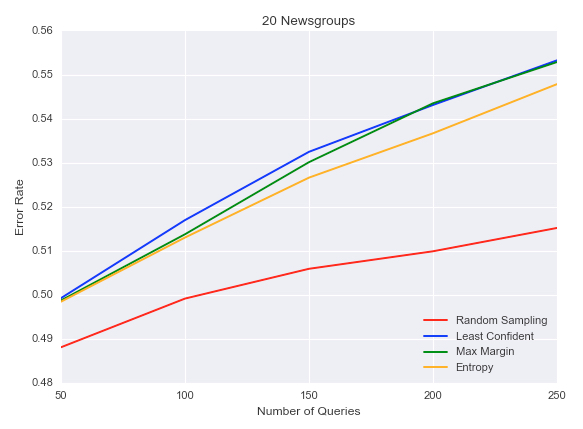

# alp: active learning in python

This is a python implementation of some popular active learning techniques,
including uncertainty sampling, query-by-committee, and expected model change.
It is built on top of numpy, scipy, and sklearn.
I wrote this for my own learning purposes, but if you get something out of
it, that's great.

  

I did this while working through Burr Settles'
[excellent literature survey](http://burrsettles.com/pub/settles.activelearning.pdf).
If you are interested in this topic you should definitely read it! 
